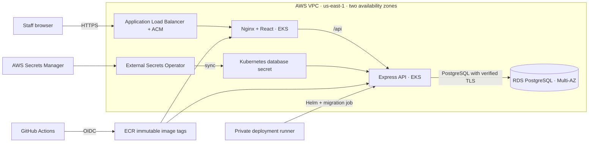
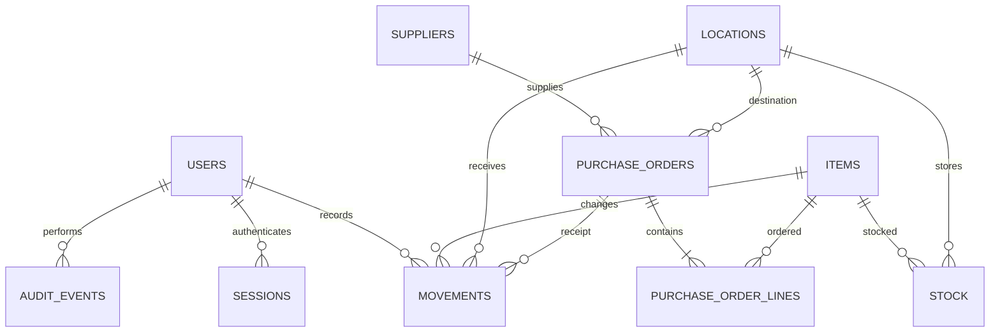

# Architecture

The frontend is a static React application served by unprivileged Nginx. Requests stay on one origin; Nginx forwards `/api` to the backend service. The backend is the only application tier with database access. The production database runs in RDS rather than a database pod, so its backup, failover, and storage lifecycle are independent of application rollouts. Docker Compose runs PostgreSQL as a container for development.

## Data model

Quantities are whole units; monetary values are PostgreSQL `numeric(12,2)`. API input validation rejects negative receipt/issue quantities, same-location transfers, zero adjustments, and duplicate order lines. SQL constraints enforce nonnegative stock and valid references.

Stock mutations lock the item row, then the item/location balance, inside one database transaction. Transfers write source and destination ledger entries together. Purchase receiving locks the order and then its item rows in UUID order. All stock writers use that ordering to prevent conflicting transfers and receipts from losing updates. A received order short-circuits subsequent receive requests; other invalid state changes return HTTP 409. Failed transactions also roll back their audit records.

Manual stock submissions do not have a general-purpose idempotency key. The UI disables its form during submission; if a network response is lost, inspect the ledger before retrying a manual receipt.

## Access model

| Capability | Viewer | Staff | Manager | Admin |
| --- | --- | --- | --- | --- |
| Read stock, orders, locations, suppliers | Yes | Yes | Yes | Yes |
| Receive, issue, transfer stock | — | Yes | Yes | Yes |
| Adjust stock counts | — | — | Yes | Yes |
| Create/edit items; create locations/suppliers | — | — | Yes | Yes |
| Create/submit/receive/cancel purchase orders | — | — | Yes | Yes |
| View audit trail | — | — | Yes | Yes |
| Manage users and roles | — | — | — | Yes |
| Change own password | Yes | Yes | Yes | Yes |

Authorization is checked on the server, independent of which buttons the frontend displays. Account deactivation and role changes delete that user's existing sessions. An administrator cannot deactivate or change their own role through this API.

Sessions use random 256-bit tokens, with only SHA-256 token hashes stored in PostgreSQL. Passwords use independently salted scrypt hashes. Production session cookies are Secure, HttpOnly, SameSite=Strict, scoped to `/api`, and expire after eight hours. Mutating requests require an exact allowed Origin. No public signup or password-reset email flow exists.

## Deployment boundaries

Terraform creates two private worker subnets, two isolated database subnets, two public load-balancer subnets, a NAT gateway in each zone, EKS managed nodes, ECR repositories, and RDS. The EKS API is private by default. The GitHub build role can push only to the two application repositories; the deployment role can discover this cluster and obtains namespace-limited Kubernetes RBAC. Controller roles are bound to specific service accounts through IRSA.

The Helm chart uses non-root containers, read-only container filesystems, restricted pod security, resource requests/limits, readiness/liveness probes, disruption budgets, and API autoscaling. VPC CNI network-policy enforcement is enabled. Nginx can reach the API; API and migration/operator pods can reach PostgreSQL. Network policies depend on the installed CNI enforcing them.

Platform bootstrap installs the AWS Load Balancer Controller and External Secrets Operator before the application chart. The database secret exists before the pre-install migration hook runs. Schema migrations are serialized with a PostgreSQL advisory lock. They are tracked by filename and applied once; applied migration files must not be edited.
