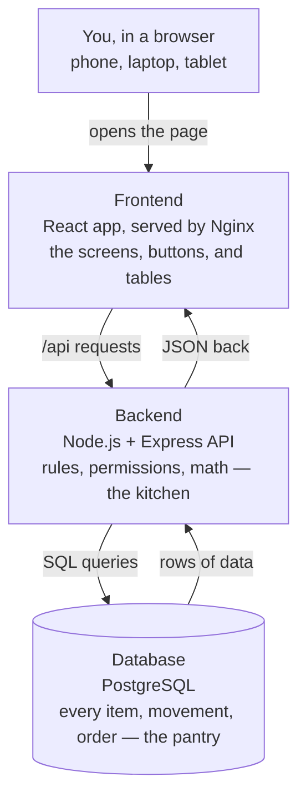
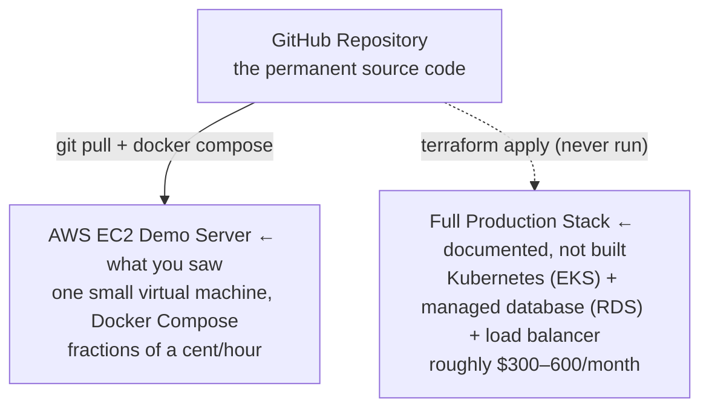
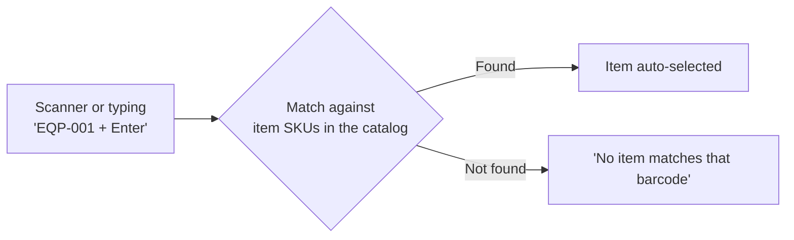
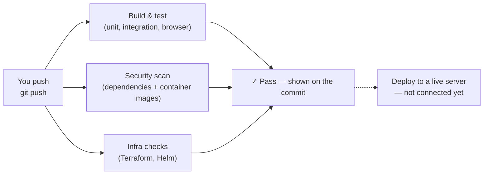

# What We Built, In Plain English

This page explains the inventory app, the temporary AWS demo it was shown on, the barcode-scanning feature, and the CI/CD pipeline — written so none of it requires a technical background to follow. For the detailed technical reference, see [ARCHITECTURE.md](ARCHITECTURE.md); for AWS provisioning steps, see [DEPLOYMENT.md](DEPLOYMENT.md).

## 1. The three pieces that make it work

Picture a small restaurant. The dining room is what a customer sees and touches. The kitchen does the actual work out of sight. The pantry is where the ingredients live. This app is built the same way, split into three independent pieces that only talk to each other over the network — never sharing files or memory directly.

All three pieces run in separate Docker containers, but on one single machine right now — one server, three containers. The database is the only piece that remembers anything between visits.

## 2. Where is it actually running?

Code sitting in GitHub doesn't run itself — it's the blueprint, not the building. Something has to actually switch the app on. GitHub is the permanent home of the code; a server is a temporary, disposable place to run a copy of it.

Two very different paths turn that blueprint into a real, reachable website. We built the cheap, fast one to look at the app together. The expensive, durable one is fully written down in [DEPLOYMENT.md](DEPLOYMENT.md) but was deliberately not built.

Both paths read the same code. The difference is durability, cost, and how much AWS machinery stands behind the app once it's live. The demo server was torn down after review — nothing is left running or costing money from it. The code that produced it is still safely in GitHub, ready to stand back up in minutes.

## 3. The new trick: scanning barcodes

Every item in the catalog already carries a short code — its SKU, like `EQP-001` for a digital thermometer. Barcode scanning doesn't add anything new to the database; it just gives a faster way to type that code in.

A handheld scanner is really just a keyboard in disguise: point it at a barcode, and it "types" the code and hits Enter for you. A phone camera can do the same job by reading the barcode visually, but only on Android Chrome over a secure (HTTPS) connection — a browser rule to stop rogue websites from turning on your camera, which is also why it wasn't available on the plain-HTTP demo server.

Scanning only *looks an item up*; it never creates one. The real setup step lives in the catalog: when adding a new product, set its SKU to match that product's actual printed barcode. From then on, scanning that barcode anywhere in the app — search, or recording a stock movement — finds it instantly.

## 4. The robot that checks every change

"CI/CD" is just a name for a robot assistant: every time code changes, it automatically rebuilds the app, runs the tests, and checks for known security holes — before a human has to worry about any of it. This project's robot runs on GitHub Actions (`.github/workflows/ci.yml`, the "Validate" workflow).

When we turned this on, every single run had actually been failing — including the ones for the barcode feature. Three layered problems, found and fixed in order:

1. **A typo.** The security-scanning tool was referenced as version `0.33.1` instead of `v0.33.1` — close enough to look right, wrong enough to never run at all.
2. **A deleted version.** Once that resolved, the tool's own default internal version turned out to no longer exist upstream — pinned explicitly to a current one instead.
3. **Real findings.** With the scanner actually working, it found genuine issues: an outdated system package, a bundled tool (`npm`) that isn't even used when the app runs but was shipping its own vulnerable dependencies anyway, and an out-of-date base image. All three are now patched, and both container images scan clean.

Every push is automatically checked; nothing is automatically deployed anywhere — that's a deliberate choice for now, not an oversight.

## 5. Words worth knowing

| Term | What it actually means here |
| --- | --- |
| Repository | The project's folder, plus its entire history of changes, stored on GitHub. |
| Commit / push | Saving a change, then sending it up to GitHub so it's no longer only on one laptop. |
| Container (Docker) | A sealed box holding one piece of the app and everything it needs to run, so it behaves the same anywhere it's started. |
| CI / CD | "Continuous Integration / Continuous Deployment" — the robot that automatically checks (and optionally ships) every change. |
| Pipeline | The specific list of automated steps the robot runs, in order. |
| EC2 | Amazon's rented-by-the-hour virtual computer — what the temporary demo ran on. |
| SKU | An item's short reference code, e.g. `CLN-001` — also what barcode scanning matches against. |
| Vulnerability scan | An automatic check for software with known, publicly documented security holes. |
| HTTPS | The padlock version of a web address; several browser features (like camera access) refuse to work without it. |
| Deploy | Actually putting a new version of the app in front of real users. |

## 6. What's still open

Nothing here is broken or urgent — these are just the decisions nobody has made yet.

- **A real domain and HTTPS.** Needed for camera-based barcode scanning to work, and for any deployment meant to last.
- **Lightweight demo vs. full production.** Keep redeploying to a cheap EC2 box as needed, or commit to the documented Kubernetes/RDS stack ([DEPLOYMENT.md](DEPLOYMENT.md)) once the app is ready for real, ongoing use.
- **Eleven pending dependency updates.** Routine version bumps opened automatically by Dependabot, now able to get an honest pass/fail from the fixed pipeline instead of a false failure.
- **Wiring up deployment.** The pipeline currently only checks code; pointing it at a real server is a deliberate next step, not an oversight.
